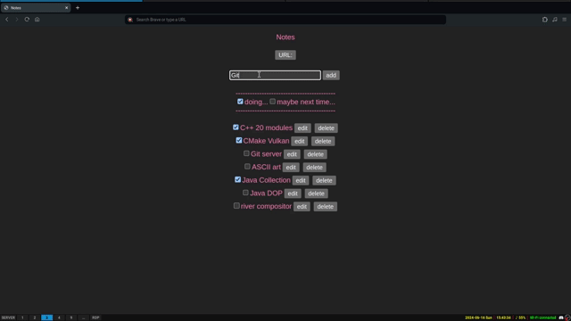

# Notes

I just want my own note-taking app.



## Create `.env` first!!!

- Ignore this if you want all `fetch` not to work
- Specify the API server URL:

```
VITE_API_URL=http://localhost/api
```

## Long live Prettier!!!

I've done those to ensure that my code is formatted

- Install `eslint-plugin-prettier` and `eslint-config-prettier`

```sh
npm install --save-dev eslint-plugin-prettier eslint-config-prettier
npm install --save-dev --save-exact prettier
```

- Edit `.eslintrc.cjs` [eslint-plugin-prettier#recommended-configuration](https://github.com/prettier/eslint-plugin-prettier#recommended-configuration)

```js
module.exports = {
  // ...
  extends: [
    // ...
    'plugin:prettier/recommended',
    // ...
  ],
  // ...
```
